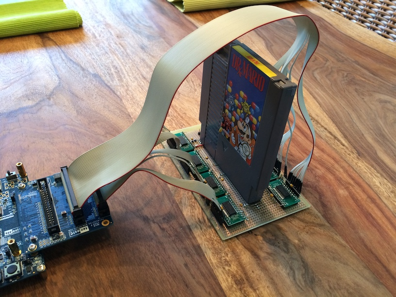

# fpgaNES

This is an implementation of the Nintendo Entertainment System in an FPGA.

It is based on the development board Cyclone V GX Starter Kit by Terasic with an
Altera Cyclone V on board. It features plenty of memory, an HDMI out and an analog
Audio Codec. For some reason they decided to not connect the HDMI audio pins of the
ADV7513 HDMI chip to the FPGA. But kindly they added solder points for the audio pins
so i was able to access them trough some GPIO pins of the FPGA getting 44.1 kHz Audio
directly through the HDMI connection. The hdmi video resolution is 640x480 at a
framerate of 50 Hz having 2x2 display pixels per NES pixel. Beside the HDMI audio pins i
soldered a NES Four Score to the GPIO-Port to simply plug/unplug the controllers to the
FPGA.

The following tests are from http://wiki.nesdev.com/w/index.php/Emulator_tests.

Test Results:

CPU)
- cpu_interrupts_v2 (5/5)
- instr_misc (2/4) : 03-dummy_reads, 04_dummy_reads_apu
- instr_timing (1/2) : 1-instr_timing (because illegal opcodes not supported yet)
- instr_test-v5 (16/16) : OFFICIAL Opcodes only
- cpu_dummy_reads (1/1)

PPU)
- oam_read (1/1)
- oam_stress (1/1)
- ppu_sprite_hit (10/10)
- ppu_open_bus (1/1)
- ppu_vbl_nmi (10/10)
- ppu_sprite_overflow (4/5) : 05-emulator

APU)
- blargg_apu_2005.07.30 (10/11) :  09.reset_timing
- apu_test (8/8)
- apu_mixer (2/4) : noise, triangle
- dmc_dma_during_read4 (1/5) : dma_2007_read, dma_2007_write, dma_4016_read, read_write_2007
- square_timer_div2 (1/1)
- test_apu_env (1/1)
- test_apu_sweep (2/2)
- test_apu_timers (4/4)
- test_tri_lin_ctr (?/1) UNSURE

What works:

- https://github.com/Klaus2m5/6502_65C02_functional_tests
- Super Mario Brothers 1
- Super Mario Brothers 2
- Super Mario Brothers 3
- Mario Bros. Classic
- Mario & Yoshi
- Donkey Kong
- The Smurfs
- Metroid
- Megaman 1-6

What works a little bit

- Micro Machines (various glitches)
- Battletoads (various glitches)

What is currently not implemented:

- low / high pass filter (i added both with the equations blargg published but for some reason they don’t work)

# How to load games with this solution

To start a game (or test rom) there are two solutions to achieve this. Either by simulating the gamepak logic within the fpga which is very simple especially for the early (and more simple) gamepaks e.g. Super Mario Brothers 1 / Donkey Kong and so on. The other way is to build some kind of hardware adapter to connect the gamepak (based on 5V logic) to the fpga, which is in my case 3.3V logic. Since i always wanted to play with the original gamepaks i decided to go with the apdapter solution.

### First adapter board
My first solution was based on 8x SN74LVC8T245DWR logic level shifters on a piece of perfboard, but since my knowledge about electronics is very limited i missed things like serial.
termination of the bus lines and short traces of the decoupling caps.

A picture of the adapter board connected to the devkit board. It also utilizes the GPIO-HSTC daughter board from Terrasic to get more gpio pins on this standard 40 pin header.

Top of the board:

Bottom of the board:

This solution worked well for simple gamepaks like Super Mario Brothers 1 which don't write back the gamepak to switch rom banks for example. Dr. Mario worked, but with various glitches and more complex gamepaks like Super Mario Brothers 3 simply didn't start.

### Second adapter board
But since i wanted to also run the more complex gamepaks **and** use an universal gamepak with a sdcard slot to bring the fantastic tests roms from http://www.nesdev.com to my fpgaNES to find all the small inaccuracies and bugs in my solution i needed a better adapter board, which means i had to improve my electronics and soldering skills.

This is a picture of my second adapter board which uses much shorter cables and the pcb was made by a manufacturer. This solution worked quite well, more advanced gamepaks like Dr. Mario and Mario Brothers 3 works flawlessly (except for the bugs in my vhdl code) and i could run test roms from the EverDrive N8 game pak.

### Third adapter board
Here you can see my third adapter board. This board have a Samtex QSH-090-01-L-D-A connector so i don't need the GPIO-HSTC daughter board and directly connect to the devkit board and added ports for the original game controllers.

#### Side view

#### Top view

### Current status
It seems i made some mistakes with my third adapter board i didn't find so far. Original gamepaks works great, no problems so far but the EverDrive N8 don't want to work any more. When i compare the signals of an original gamepak with the signals of the EverDrive N8 on my scope, i can see that orignal gamepaks produce since and clean 5V signals whereas the EverDrive N8 sometimes produce more unclean signals near 3.3V. I have to investigate further to find a solution.

At the moment the layout of the board is done in eagle. After i found by bugs i will switch to kicad to release it here for interested ones.
